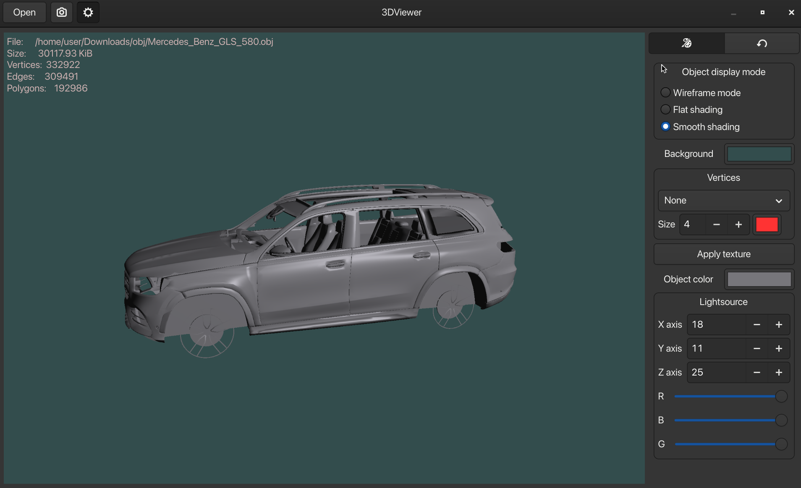

# ecole-3DViewer_v2
A simple GTK4 3D model viewer. 
Currently a work in progress.

## Building on Linux
First you need to install dependencies:
 - a C++20 compiler toolchain (gcc / clang)
 - GNU make (gmake)
 - cmake 
 - pkgconf
 - gtkmm-4.0-dev 
      
To build and run the app on Linux just run:

```sh
git clone --recurse-submodules https://github.com/barab00lka/ecole-3DViewer_v2.git
cd ecole-3DViewer_v2/src
make run
```

## Experimental native build for Windows
To build a self-contained distribution for Windows:

 ```sh
 make cross-win
 ```
> [!NOTE]
> A Fedora container image with Mingw toolchain will be created and used for the build.
>
> An archive with a PE executable (3DViewer.exe) and all needed DLLs will be created in build directory on the host

for additional build options: ` make help `

## Screenshots
[](screenshots/image.png)
[](screenshots/ak.png)

## Usage

```sh
./3DViewer
```
> [!NOTE]
> By default config is saved in $XDG_CONFIG_HOME/3DViewer.ini but config location can be overriden if launched with -c/--config flag

## Implemented features:
 - loading model mesh from Waveform .obj file
 - making 5 second GIF screencasts of the model
 - config with autosave for styling settings persistence
 - translating and scaling the model
 - orthographic / perspective projection toggle
 - lighting with flat shading or smooth shading (Phong)
 
